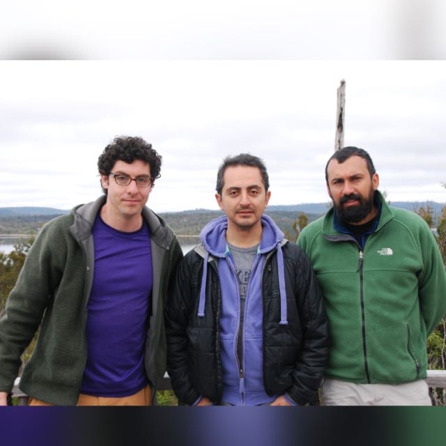
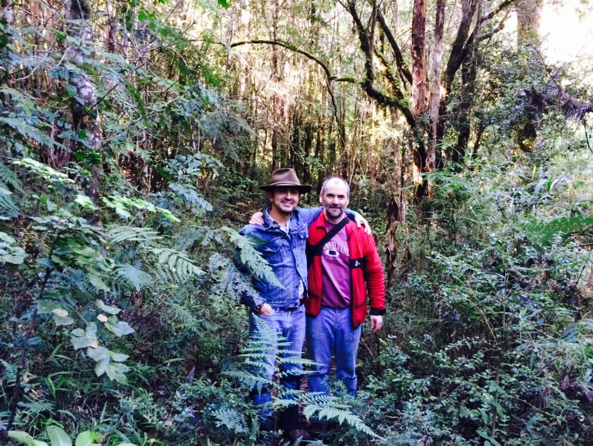
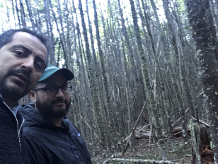

> *Colleagues with whom I collaborate in ongoing studies*

## In Chile

* *[Pablo Donoso](https://www.researchgate.net/profile/Pablo_Donoso)*, Professor of Silviculture, Universidad Austral de Chile, Valdivia, Valdivia.
* *[Rodrigo Vargas-Gaete](https://rodrigovargasgaete.cl)*, Associate Professor of Restoration, Universidad de La Frontera, Temuco.
* *[Daniel Soto](https://sites.google.com/view/silviculture/danielsotowebpage)*, Assistant Professor of Silviculture, Universidad de Aysen, Coyhaique.
* *[Andrés Fuentes-Ramirez](https://andresfuen.weebly.com)*, Assistant Professor of Fire Ecology, Universidad de La Frontera, Temuco.
* *[Dylan Craven](https://dylancraven.com)*, Associate Professor of Macroecology, Universidad Mayor, Santiago.
* *[Cesar Arriagada](http://biorremediacion.ufro.cl)*, Professor of Biorremediation, Universidad de La Frontera, Temuco.
* *[Juan Pablo Fuentes](http://sel.forestaluchile.cl/)*, Associate Professor of Soil Ecology, Universidad de Chile, Santiago.

## Abroad

* *[Aaron Weiskittel](https://forest.umaine.edu/faculty-staff/aaron-weiskittel/)*, Professor of Forest Biometrics, University of Maine, USA.
* *[Timothy G. Gregoire](https://environment.yale.edu/profile/gregoire)*, Professor of Biometrics and Environmental Statistics, Yale University, USA.
* *[Hailemariam Temesgen](http://fmbl.forestry.oregonstate.edu)*, Professor of Forest Biometrics, Oregon State University, Corvallis, USA.
* *Lauri Mehtätalo*, Professor of Forest Biometrics at the Universty of Eastern Finland, Joenssu, Finland.

With Rodrigo and Andres in Tantauco (2016)

Daniel, Andres and Rodrigo in the National Reserve China Muerta (2017)

With Pablo in Llancahue (2015)

With Daniel in the National Reserve Coyhaique (2018)

With Aaron in southern Chile  (2017)

With Hailemariam's group in Corvallis (2016)

