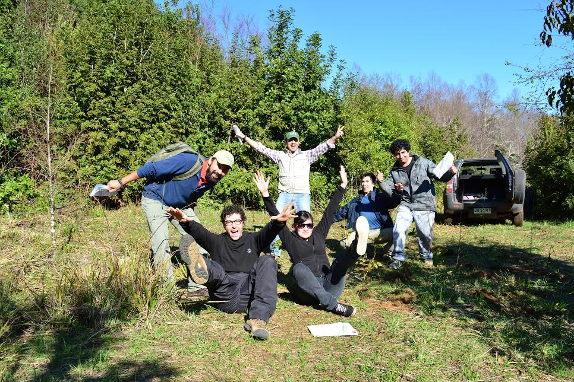

> *I have listed current researchers and students directly working with me.*

## Researchers
|   |   |   | 
|---|---|---|
| *Joaquín Riquelme*  |Natural Resources Engineer, M.S.   |   | 

--------

## Students

|   |   |   |
|---|---|---|
|*Danniela Espinoza*  | B.S. in Forest Engineering, Universidad de Chile (Santiago, Chile)   |   |
|*Antonia Astorga*  | B.S. in Biology, Universidad de Chile (Santiago, Chile)   |   |

--------

<!-- ### Footer
`2020`
*Juan Pino*, Master in Natural Resources Management, Universidad de La Frontera. Currently at Ministry of the Environment (Temuco, Chile).

#`2021`
#*Heraldo Carvacho*, Master in Natural Resources Management, Universidad de La Frontera. Currently at #Town council of Pudahuel (Santiago, Chile).

`2019`
*Joaquín Riquelme*, Master in Natural Resources Management, Universidad de La Frontera. Currently a Research Assistant, Universidad Mayor (Santiago, Chile).

Last updated: August 2020 -->
